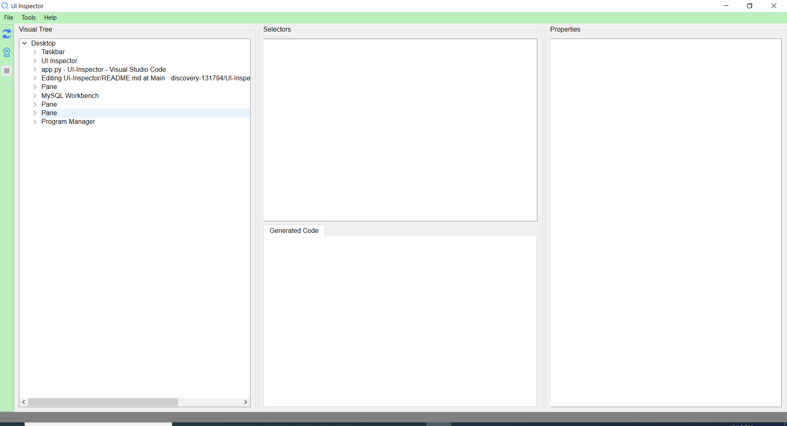
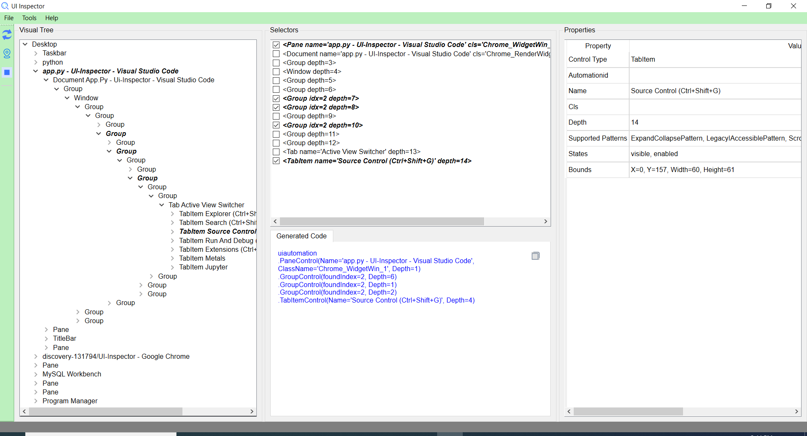

# UI-Inspector

UI-Inspector is a GUI tool that can be used to view the whole windows desktop UI structure and property of every UI node.
For python developers who use uiautomation and pyjab to develop automation scripts, they can use mouse pointer to choose element they want to check, then UI-Inspector will generate tree structure and corresponding code for specified UI element.
Now, UI-Inspector supports most windows desktop applications which implemented uiautomation framework and java applications. In the future, I will try to add XML document support and maybe itegrate selenium to it.

## Installation
UI-Inspector can be installed from PYPI:

```sh
pip install uiinspector
```
then run command below:

```sh
ui-inspector
```

or you can use pyinstaller to build an executable.

Download source code from git, enter into main directory and run command below:

```sh
pyinstaller app.spec
```

## Dependencies
UI-Inspector depends on below packages:
- [PySide6](https://pypi.org/project/PySide6/)
- [uiautomation](https://github.com/yinkaisheng/Python-UIAutomation-for-Windows)
- [pyjab](https://github.com/gaozhao1989/pyjab)
- [mouse](https://github.com/boppreh/mouse)
- [keyboard](https://github.com/boppreh/keyboard)

## Usage
When UI-Inspector application starts, the GUI will be displayed as below:


After indicating element on desktop, the GUI will be displayed as below:


As you can see, there are several fields on the GUI.
The left dock consists of three buttons:
- `Refresh (F5)`, it's used to refresh the whole tree structure once new application opened or application closed.
- `Indicate Element (Ctrl + I)`, when clicking this button, UI-Inspector window will be minimized and user can choose application element on desktop.
- `Highlight Element (Ctrl + H)`, click this button to validate the genereated tree structure and code.

The main window of UI-Inspector consists of four fields:
- `Visual Tree`, this field will display tree structure of the whole desktop, you can expand it to show children of some element. Click will show property of specified
  element, double-click will show selectors and generated code of specified element.
- `Selectors`, this field will display position of some element in the desktop tree structure.
- `Properties`, this field will diaplay properties of specified element.
- `Generated Code`, this field will show python code UI-Inspector generated for you, the code can be used in automation script to locate element.

## Shortcuts
There are some shortcuts when indicating element:
- `ESC`, back to main window of UI-Inspector.
- `F2`, into normal mode then back to indicating element mode in 5 seconds. In the period, user can navigate to some hidden controls.
- `Enter`, sometimes UI control may disappear when clicking mouse, `enter` can achive the same effect as clicking mouse.

